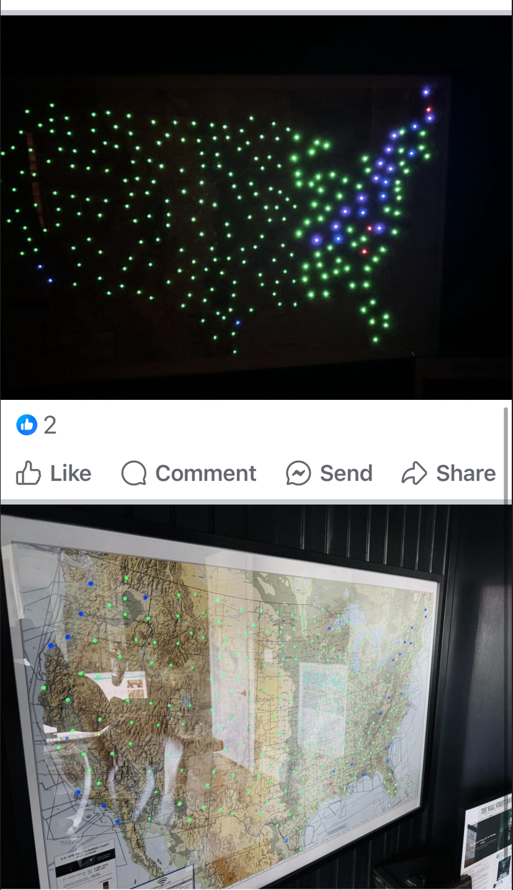
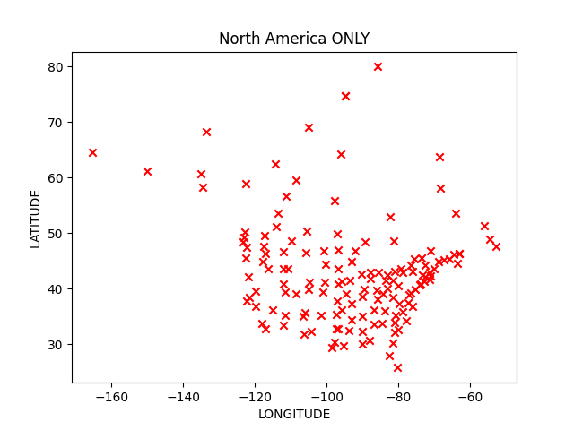
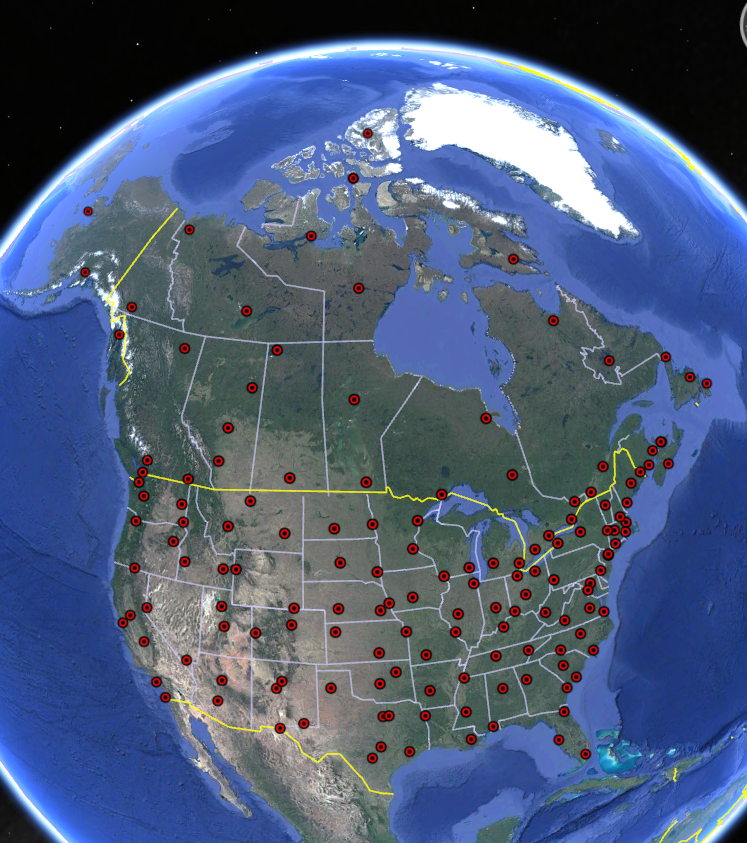
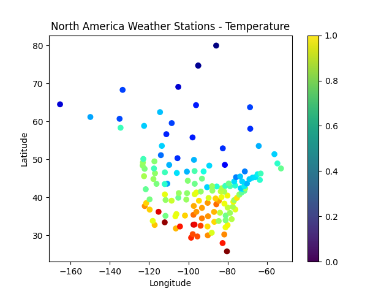
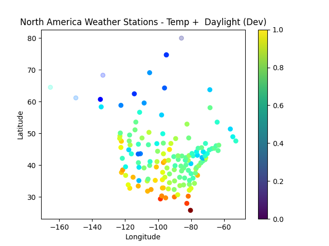
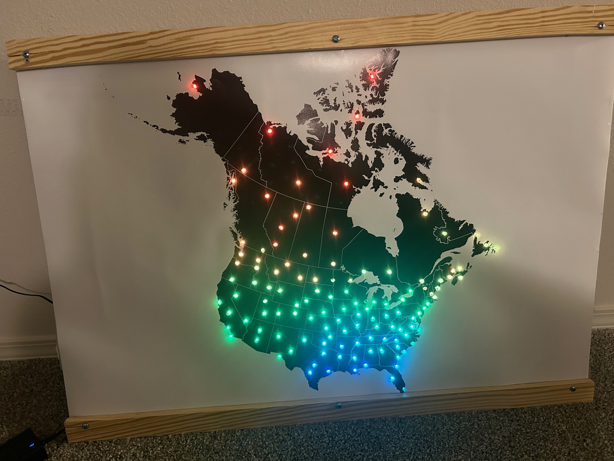
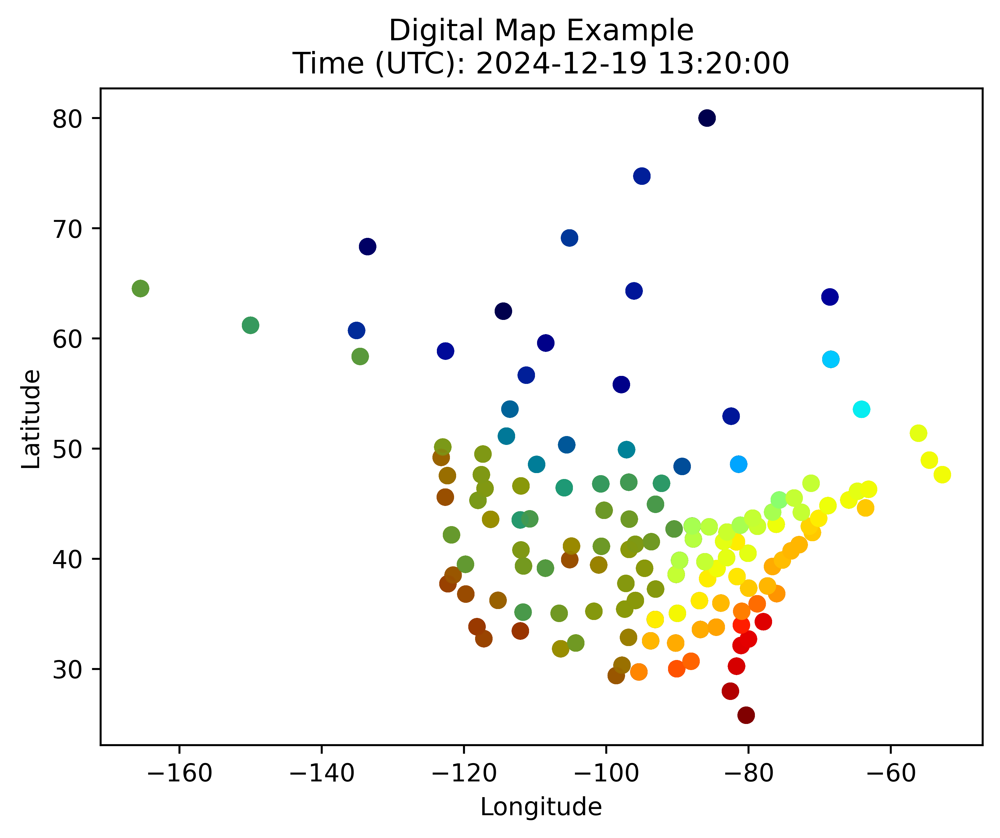
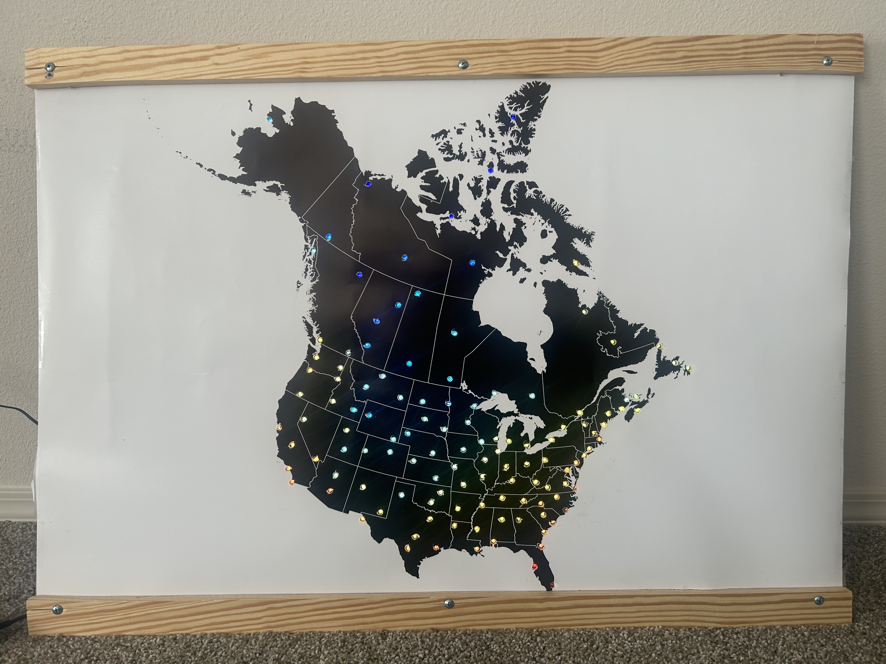

# LIGHT UP MAP PROJECT
This project is based on this project, which I found on Facebook. They are commercially available here: https://metarmaps.com/. I wanted to add Canada, and a select few cities that are meaningful to me. I want to learn to solder and properly implement a reliable RPI based sym to run the final product.

## Basis
This project is based on the Metostat library of maintained weather data across the globe.

Check out Metostat:
    https://meteostat.net/en/

Starting set of north american city coordinates courtesy of: https://www.infoplease.com/us/geography/latitude-and-longitude-us-and-canadian-cities

Futher edits and functionality beyond these two sources are built by yours truly. 

## Version Compatibility
I am running this on a Raspberry Pi Zero running Bullseye and Python 3.9.2 with the following dependencies:

    rpi_ws281x
    adafruit-circuitpython-neopixel
    meteostat
    suntime

It should be noted that in addition to these requirements, these items needed to be run

    sudo python3 -m pip install --force-reinstall adafruit-blinka
    sudo apt-get install python3-pandas

 Plus: 

    "raspi-config" & enable GPIO pins

For testing I am running these requirements on PC with Python 3.9.2: 

    matplotlib==3.9.2
    meteostat==1.6.8
    suntime==1.3.2

Additional requirements & versions can be found in the "requirements.txt" file.

## Current State
Ability to pull weather stations from a list of starting points (city coordinates) (which has been updated to reduce iterations to find them in future reps.) and plot them on a matplotlib scatter plot. The weather station coordinates are also exported to .csv. CSV coords can easily be imported to google earth pro and viewed to validate point density (as shown below).

 

Functionality has been added to grab current temperatures at each of the selected weather stations, and colour map them between the High/Low temperatures in the range. RGB values are extracted to a DF to be applied to the LEDs in future works. For troubleshooting the RGB colours are plotted on a Matplotlib plot.

A base map has also been created and printed, using QGIS (https://www.qgis.org/) software, along with shapefiles of Canada, and the United States exported from fed resources (linked in the future). Basemap seen below.

Added the ability to check if each station is in local daylight. Plotting on Matplotlib as semi-transparent.

Plotting actual weather station coordinates on top of map that was actually printed using QGIS, we can thin out the datapoints such that the actual build looks cleaner and less crowded. This is the current state: 

Map as shown above has been printed, and assembled onto a POC frame, consisting of an MDF backboard, and two pine upper/lower boarders to squeeze the map poster in place. 
Ø 1/4" holes are drilled, for the neopixels, all ~130 neopixels are hot glued onto the back of the MDF board. 3x 22AWG solid core wires are soldered onto the first neopixel, with 3x wires extending from each neopixel to the subsequent (6x leads on each neopixel).

A 5V 45W laptop charger is used to power the system. According to neopixel best practices a 400Ω resistor is equipped to reduce noise in the data line, and a 1000µF capacitor is used to control power surges in the 5V line. Power is injected at the start, mid-point, and end of the neopixel series. A quad-level shifter (Adafruit: 74AHCT125) is used to shift the 3.3V data signal output from RPI into a 5V signal, both at the start and midpoint of the neopixel sequence.

The below picture shows the build's current state: 

A digital timelapse of the project is made, and will be used to later contrast a timelapse of the physical project itself. 
"GenDigitalMap.py" is used to generate the timelapse data across a date range, and resolution specified. 
"MapDemoVidMaker.py" combined the timelapse images into a video.

Click the image below to view the digital timelapse on Youtube. Note temperatures only refresh every hour:

Contrasting this digital example, the physical build is shown on January 01 @ noon:

To calibrate the system - getting the order of build LEDs digitized, the following map was generated. This map has an identical background to the build, and shows overlaid Longitude (blue), and latitude (red). 

## Future Works
This project is marked as complete for the time being. Some things I would like to add in the future when I come back around to this project:

- Make a proper timelapse of the actual build, and contrast it to the digital timelapse.

- Speed up the data refresh time, and/or run it in the background, so that I can increase the frequency of temperature refreshing. It takes a few minutes to gather temperature data on the RPIZero.

- Make a cooler light show during the transition, just something that is fun.
    

## Running on RPI, headless without killing program when disconnecting ssh session:
Mainly notes for myself if I forget.

Need to have screen installed

    sudo apt-get install screen

Running using detached screen. From: https://stackoverflow.com/questions/55462226/how-can-i-keep-a-python-script-on-a-remote-server-running-after-closing-out-of-s

    screen                          #-- init screen
    sudo python RPI_main.py
    Ctrl+A then D                   #-- This detaches the screeen
    ## you can now exit the screen / kill the ssh session as needed

    ## --------- reconnecting: -----------
    screen -ls                      #-- this will list currently running screen.
    screen -r 13081                 #-- 13081 is an example of the 5 digit ID number you will need to reconnect to the screen.