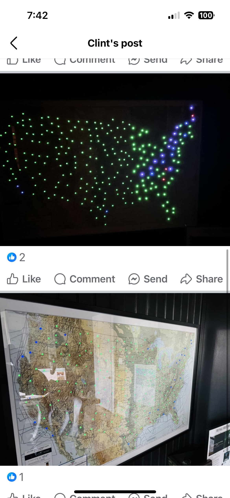
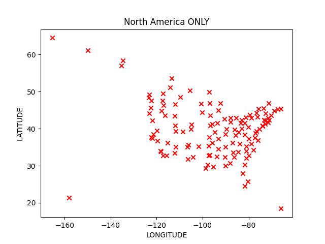
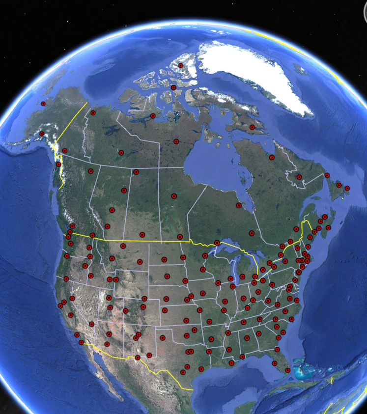

# LIGHT UP MAP PROJECT
This project is based on this project, which I found on Facebook. I believe they are commercially available somewhere. I wanted to add Canada, and a select few cities that are meaningful to me. I want to learn to solder and properly implement a reliable RPI based sym to run the final product.

## Basis
This project is based on the Metostat library of maintained weather data across the globe.

Check out Metostat:
    https://meteostat.net/en/

Starting set of north american city coordinates courtesy of: https://www.infoplease.com/us/geography/latitude-and-longitude-us-and-canadian-cities

Futher edits and functionality beyond these two sources are built by yours truly. 

## Current State
Ability to pull weather stations from a list of starting points (city coordinates) (which has been updated to reduce iterations to find them in future reps.) and plot them on a matplotlib scatter plot. The weather station coordinates are also exported to .csv. CSV coords can easily be imported to google earth pro and viewed to validate point density (as shown below).

 

## Future Works
The goal is to build this puppy. Currently narrowing down the LED dimming, changing with temperature etc. functionality as of the time of writing this README. More updates to come.

