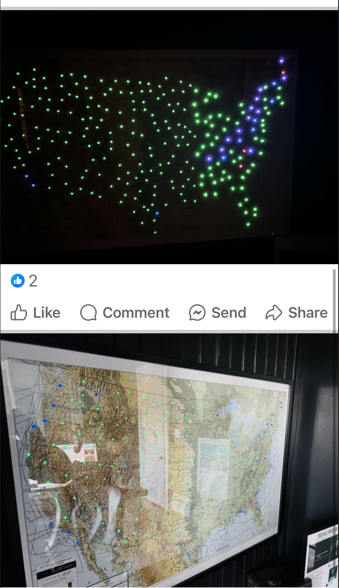
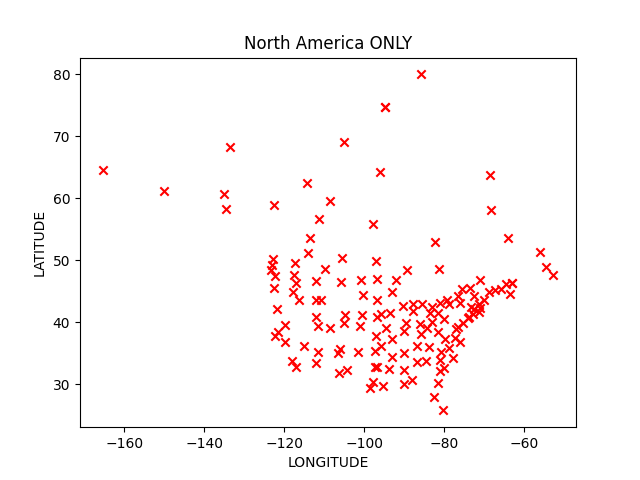
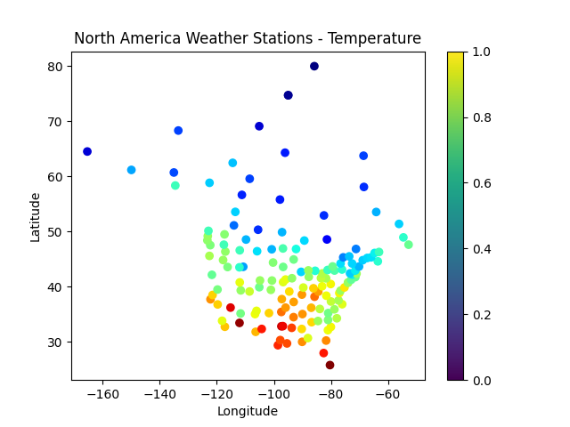
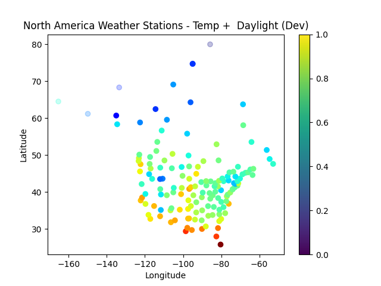

# LIGHT UP MAP PROJECT
This project is based on this project, which I found on Facebook. They are commercially available here: https://metarmaps.com/. I wanted to add Canada, and a select few cities that are meaningful to me. I want to learn to solder and properly implement a reliable RPI based sym to run the final product.

## Basis
This project is based on the Metostat library of maintained weather data across the globe.

Check out Metostat:
    https://meteostat.net/en/

Starting set of north american city coordinates courtesy of: https://www.infoplease.com/us/geography/latitude-and-longitude-us-and-canadian-cities

Futher edits and functionality beyond these two sources are built by yours truly. 

## Version Compatibility
I am running this on a Raspberry Pi Zero running Bullseye and Python 3.9.2 with the following dependencies:

    rpi_ws281x
    adafruit-circuitpython-neopixel
    meteostat
    suntime

It should be noted that in addition to these requirements, these items needed to be run

    sudo python3 -m pip install --force-reinstall adafruit-blinka
    sudo apt-get install python3-pandas

 Plus raspi-config and enable GPIO pins

For testing I am running these requirements on PC with Python 3.9.2: 

    contourpy==1.3.0
    cycler==0.12.1
    fonttools==4.55.0
    importlib_resources==6.4.5
    kiwisolver==1.4.7
    matplotlib==3.9.2
    meteostat==1.6.8
    numpy==2.0.2
    packaging==24.2
    pandas==2.2.3
    pillow==11.0.0
    pyparsing==3.2.0
    python-dateutil==2.9.0.post0
    pytz==2024.2
    six==1.16.0
    suntime==1.3.2
    tzdata==2024.2
    zipp==3.21.0

## Current State
Ability to pull weather stations from a list of starting points (city coordinates) (which has been updated to reduce iterations to find them in future reps.) and plot them on a matplotlib scatter plot. The weather station coordinates are also exported to .csv. CSV coords can easily be imported to google earth pro and viewed to validate point density (as shown below).

 

Functionality has been added to grab current temperatures at each of the selected weather stations, and colour map them between the High/Low temperatures in the range. RGB values are extracted to a DF to be applied to the LEDs in future works. For troubleshooting the RGB colours are plotted on a Matplotlib plot.

A base map has also been created and printed, using QGIS (https://www.qgis.org/) software, along with shapefiles of Canada, and the United States exported from fed resources (linked in the future). Basemap seen below.

Added the ability to check if each station is in local daylight. Plotting on Matplotlib as semi-transparent.

Plotting actual weather station coordinates on top of map that was actually printed using QGIS, we can thin out the datapoints such that the actual build looks cleaner and less crowded. This is the current state: 

## Future Works
The goal is to build this puppy. LEDs are purchased.

TODOs
    - Drill holes in map at roughly correct locations
    - Fix LEDs in place (hot glue (?))
    - Solder LEDs together in a known order
    - Develop method to translate current main dataframe (Keepers_Export.csv // Keepers_Export.pkl) into LED product readable information
    

